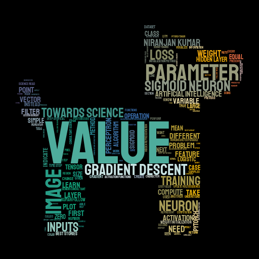
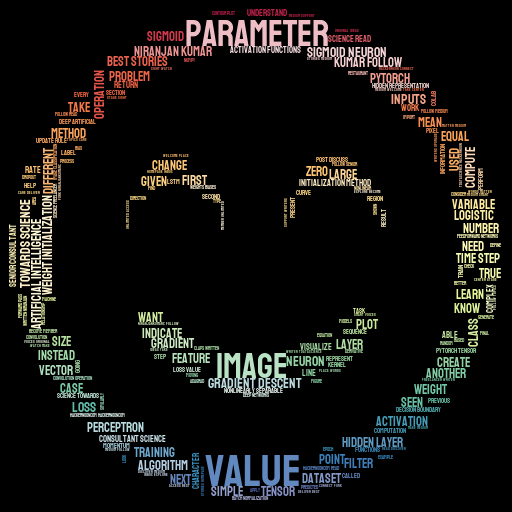

# Analyzing all my Data Science Blogs using NLP

* This repository contains the code to scrap the contents all of my articles and process the data using the NLTK Package for further analysis. To scrap the data, we will be using Selenium and BeautifulSoup. 
* After cleaning the data, we will be creating wordclouds to identify the top topics from the corpus

---
**Some of the wordclouds generated**:

----

